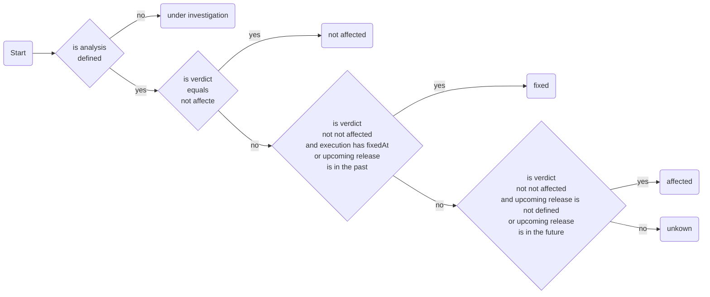

<div style="text-align: center;"></div>

# Vulnlog - Software Vulnerability Logging for Developers

**Caution: The project is still in early development, the DSL, CLI commands and the report are subject to change.** Any
feedback on the tool is very appreciated!


If you analyze and manage software vulnerabilities reported by a Software Component Analyzer (SCA), Vulnlog helps
streamline the process.

Vulnlog provides a simple Domain Specific Language (DSL) for describing reported vulnerabilities. The DSL also allows
you to define how and when the reported vulnerability should be handled. For example, in the next bugfix release, a
vulnerable dependency should be updated to version x. Vulnlog helps you with your software project:

- Log all reported software vulnerabilities in your repository.
- Create vulnerability reports for your team members and the project owner or manager.
- Don't forget to update vulnerable dependencies in your next bug fix release.

## Table of Contents

- [Installation](#how-to-use-vulnlog-in-your-project)
- [DSL Reference](#dsl)
- [HTML Report](#html-report)
- [Contributing & Support](#contributing--support)
- [License](#license)

Also, checkout the release change logs in [CHANGELOG.md](CHANGELOG.md), the DSL troubleshooting guide
in [TROUBLESHOOTING.md](TROUBLESHOOTING.md) and the [DSL API documentation](https://vulnlog.dev/dslapi/latest/).

## How to use Vulnlog in your Project

The easiest way is to use the Gradle Vulnlog plugin. Add the Vulnlog DSL plugin to your `build.gradle.kts` file:

```kotlin
plugins {
    id("java")
    id("dev.vulnlog.dslplugin") version "$version"
}
```

Check that the Gradle plugin is correctly applied by running the `showCliVersion` task:

```
./gradlew showCliVersion
Vulnlog $version
```

Create a Vulnlog definitions file that contains the release definitions and a vulnerability reporter for your project.
An example file is`definitions.vl.kts`:

```kotlin
releases {
    branch("branch 1") {
        release("0.1.0", "2025-01-01")
        release("0.1.1", "2025-01-23")
        release("0.2.0")
    }
    branch("branch 2") {
        release("2.0.0", "2025-02-01")
        release("2.1.0")
    }
}

reporters {
    reporter("demo reporter")
}
```

This defines two release branches `branch1` and `branch2` containing multiple releases. A release without a publication
date is still in development. Also, a reporter `demoReporter` is defined.

The next step is to create a project Vulnlog file containing your vulnerability analysis. For this demo example, the
file used is `demo.vl.kts`:

```kotlin
val branch1 by ReleaseBranchProvider
val branch2 by ReleaseBranchProvider

val demoReporter by ReporterProvider

vuln("CVE-1337-42") {
    report from demoReporter at "2025-01-28" on branch1..branch2
    analysis analysedAt "2025-01-30" verdict notAffected because """
        This is just a demo entry for demonstration purpose.
    """.trimIndent()
    task update "vulnerable.dependency" atLeastTo "1.2.3" on all
    execution suppress untilNextPublication on all
}
```

The first two lines introduce the two release branches. The third line introduces a reporter. The _CVE-1337-42_ is made
up for demonstration purposes.

- `report` describes which reporter found this CVE, when you became aware of it, and on which release branches the CVE
  was found.
- `analysis` describes when you analysed this report and the verdict you assigned, with a reason.
- `task` describes what actions are needed to get rid of this report, usually a dependency update.
- `execution` describes what should be done with this report until it is fixed.

Now generate one report per release branch: `vl definitions.vl.kts report --output ./`. This should produce
`./report-branch1.html` and `./report-branch2.html`.

## DSL

### Container Blocks

Top level DSL definitions.

| Function    | Parameters                                                                              | Return | Description                                                                  |
|-------------|-----------------------------------------------------------------------------------------|--------|------------------------------------------------------------------------------|
| `releases`  | [Release Block](#release-block)                                                         | -      | Top level defining a release block.                                          |
| `vuln`      | The ID or IDs of one or multiple vulnerability identifier and [Vuln Block](#vuln-block) | -      | Define a vulnerability entry with a single vulnerability ID or multiple IDs. |
| `reporters` | [Reporter Block](#reporter-block)                                                       | -      | Top level defining a reporters block.                                        |

### Providers

Providers to provide values from the `definitions.vl.kts` file.

| Provider        | Description                                                                                                                              |
|-----------------|------------------------------------------------------------------------------------------------------------------------------------------|
| `ReleaseBranch` | Provide a release branch name. For example `val v1 by ReleaseBranch` provides the `v1` release branch  of the `definitions.vl.kts` file. |

### Specifiers

Release specifier.

| Specifier  | Description                                                       |
|------------|-------------------------------------------------------------------|
| `all`      | All releases that are defined in the report.                      |
| `allOther` | All other releases that are not already specified in a statement. |

Suppression specifier.

| Specifier              | Description                                                                |
|------------------------|----------------------------------------------------------------------------|
| `permanent`            | Permanently suppress a vulnerability.                                      |
| `temporarily`          | Temporarily suppress a vulnerability.                                      |
| `untilNextPublication` | Suppress a vulnerability until the successor release version is published. |

Verdict specifier.

| Specifier     | Description                                                                                  |
|---------------|----------------------------------------------------------------------------------------------|
| `critical`    | Vulnerability analysis resulted in critical impact to software project.                      |
| `high`        | Vulnerability analysis revealed high impact on software project.                             |
| `moderate`    | Vulnerability analysis revealed moderate impact on software project.                         |
| `low`         | Vulnerability analysis revealed low impact on software project.                              |
| `notAffected` | Vulnerability analysis revealed that the vulnerability does not affect the software project. |

### Release Block

Define a release version and optionally a publication date or a release branch.
Release version without publication date are still in development.

| Function  | Parameters                                                   | Return                                        |
|-----------|--------------------------------------------------------------|-----------------------------------------------|
| `release` | The version string and optionally a publication date string. | -                                             |
| `branch`  | The release branch name string                               | [Release Branch Block](#Release-Branch-Block) |

#### Release Branch Block

Define a release version and optionally a publication date in YYYY-MM-dd. Release version without publication date are
in development.

| Function  | Parameters                                                   | Return |
|-----------|--------------------------------------------------------------|--------|
| `release` | The version string and optionally a publication date string. | -      |

### Vuln Block

| Field                     | Description                                                                        |
|---------------------------|------------------------------------------------------------------------------------|
| [`report`](#Report)       | Contains the report information.                                                   |
| [`analysis`](#analysis)   | Contains the analysis information, requires a definition of the `report` variable. |
| [`task`](#Task)           | Contains the task information, requires a definition of the `analysis` variable.   |
| [`execution`](#Execution) | Contains the execution information, requires a definition of the `task` variable.  |

#### Report

Defines what reporter found the vulnerability.

| Function | Parameters                                  | Return                      |
|----------|---------------------------------------------|-----------------------------|
| `from`   | The reporter that found the vulnerability.  | [Report From](#Report-From) |
| `from`   | The reporters that found the vulnerability. | [Report From](#Report-From) |

##### Report From

Defines the date since when the software security engineering team is aware of this vulnerability.

| Function | Parameters                                                | Return                            |
|----------|-----------------------------------------------------------|-----------------------------------|
| `at`     | A date string in the format YYYY-MM-dd, e.g. `2025-03-07` | [Report From On](#Report-From-On) |

###### Report From On

Define on what release branches the reported vulnerability were found.

| Function | Parameters                                | Return                                   |
|----------|-------------------------------------------|------------------------------------------|
| `on`     | A range of release branches e.g. `v1..v2` | Starting point for [Analysis](#Analysis) |

#### Analysis

| Function     | Parameters                                                                                                  | Return                                                |
|--------------|-------------------------------------------------------------------------------------------------------------|-------------------------------------------------------|
| `analysedAt` | A date string in the format YYYY-MM-dd, e.g. `2025-03-07`. If not specified the date of the report is used. | [Analysis Analysed At Verdict](#Analysis-Analysed-At) |
| `verdict`    | A verdict based on the analysis of the report on the software project.                                      | [Analysis Reasoning](#Analysis-Reasoning)             |

##### Analysis Analysed At

| Function  | Parameters                                                             | Return                                    |
|-----------|------------------------------------------------------------------------|-------------------------------------------|
| `verdict` | A verdict based on the analysis of the report on the software project. | [Analysis Reasoning](#Analysis-Reasoning) |

##### Analysis Reasoning

| Function  | Parameters                                | Return                           |
|-----------|-------------------------------------------|----------------------------------|
| `because` | The reasoning why the verdict was chosen. | Starting point for [Task](#Task) |

#### Task

| Function       | Parameters                            | Return                                       | Description                                     |
|----------------|---------------------------------------|----------------------------------------------|-------------------------------------------------|
| `update`       | The dependency to update as string.   | [Task At Least To](#task-update-at-least-to) | Update a specific dependency.                   |
| `noActionOn`   | A Release specifier.                  | Starting point for [Execution](#execution)   | No action is needed.                            |
| `waitOnAllFor` | Duration to wait fore, e.g. `14.days` | Starting point for [Execution](#execution)   | Wait for the specified time and then reanalyse. |

##### Task Update At Least To

| Function    | Parameters        | Return                                           | Description                               |
|-------------|-------------------|--------------------------------------------------|-------------------------------------------|
| `atLeastTo` | A version string. | [Task On](#task-specify-release-branch-versions) | Update at least to the specified version. |

##### Task Specify Release Branch Versions

| Function | Parameters                                | Return                                                                                                      | 
|----------|-------------------------------------------|-------------------------------------------------------------------------------------------------------------|
| `on`     | A Release specifier.                      | Starting point for [Execution](#Execution) or [Task Follow UP Specification](#task-follow-up-specification) | 
| `on`     | A range of release branches e.g. `v1..v2` | Starting point for [Execution](#Execution) or [Task Follow UP Specification](#task-follow-up-specification) | 
| `on`     | A release branches e.g. `v1`              | Starting point for [Execution](#Execution) or [Task Follow UP Specification](#task-follow-up-specification) | 

##### Task Follow UP Specification

| Function             | Parameters                                | Return                                           | Description                                                   | 
|----------------------|-------------------------------------------|--------------------------------------------------|---------------------------------------------------------------|
| `andNoActionOn`      | A range of release branches e.g. `v1..v2` | Starting point for [Execution](#Execution)       | No further action required on specified release branch range. |
| `andNoActionOn`      | A release branches e.g. `v1`              | Starting point for [Execution](#Execution)       | No further action required on specified release branch.       |
| `andUpdateAtLeastTo` | A version string.                         | [Task On](#task-specify-release-branch-versions) | Update at least to the specified version.                     |

#### Execution

| Function   | Parameters                                                 | Return                                                            | Description                                                   |
|------------|------------------------------------------------------------|-------------------------------------------------------------------|---------------------------------------------------------------|
| `fixedAt`  | A date string in the format YYYY-MM-dd, e.g. `2025-03-07`. | [Task At Least To](#Execution-Specify-Release-Branch-Versions)    | Mark a vulnerability as fixed.                                |
| `suppress` | [`permanent`](#specifiers)                                 | [Task At Least To](#Execution-Specify-Release-Branch-Versions)    | Suppress a vulnerability permanently.                         |
| `suppress` | [`temporarily`](#specifiers)                               | [Execution Suppress Temporarily](#Execution-Suppress-Temporarily) | Suppress a vulnerability for a certain amount of time.        |
| `suppress` | [`untilNextPublication`](#specifiers)                      | [Task At Least To](#Execution-Specify-Release-Branch-Versions)    | Suppress a vulnerability until the next release is published. |

##### Execution Suppress Temporarily

| Function  | Parameters                            | Return                                                         | 
|-----------|---------------------------------------|----------------------------------------------------------------|
| `forTime` | Duration to wait fore, e.g. `14.days` | [Task At Least To](#Execution-Specify-Release-Branch-Versions) | 

##### Execution Specify Release Branch Versions

| Function | Parameters                                | Return                              | 
|----------|-------------------------------------------|-------------------------------------|
| `on`     | A Release specifier.                      | A complete [Execution](#Execution)  | 
| `on`     | A range of release branches e.g. `v1..v2` | A complete [Execution](#Execution)  | 
| `on`     | A release branches e.g. `v1`              | A complete  [Execution](#Execution) | 

### Reporter Block

Define a reporter to use in `vuln` definitions. A reporter is anything or anyone who makes you aware of a vulnerability
in your software project.

| Function   | Parameters                  | Return |
|------------|-----------------------------|--------|
| `reporter` | Define a specific reporter. | -      |

## HTML Report

The generated HTML report contains a table with these top level information:

- **ID**: Describes the vulnerability with an ID. The ID does not need a special format and usually comes from your SCA
  scanner. It is also possible to use an (internal) issue number of your ticketing system.
- **Status**: The status a reported vulnerability has. See [Status Description](#status-description) below for more
  information.
- **Rating**: The impact the vulnerability may have on the software.
- **Reasoning**: Reasoning behind the rating.
- **Task**: What is necessary to get rid of this vulnerability report.
- **Affected**: What versions are affected by the vulnerability.
- **Fix**: In what version the vulnerability is planed to be fixed.

### Status Description

- **Affected**: The software project is affected by this vulnerability.
- **Fixed**: The software project is not anymore affected by this vulnerability.
- **Not Affected**: The software project is not affected by this vulnerability.
- **Under Investigation**: If the software project is affected by this vulnerability is currently under investigation.
- **Unknown**: The state of this vulnerability report is not known.

The status of a vulnerability is calculated as follows:



## Contributing & Support

We welcome contributions! Please see [CONTRIBUTING.md](CONTRIBUTING.md) for details on how to get started.

If you like the project, please consider giving it a star ⭐ and follow us on Bluesky and Mastodon:

- [vulnlog.bsky.social](https://bsky.app/profile/vulnlog.bsky.social)
- [infosec.exchange/@vulnlog](https://infosec.exchange/@vulnlog)

## License

Vulnlog is licensed under the [GPL-3.0 License](LICENSE).
