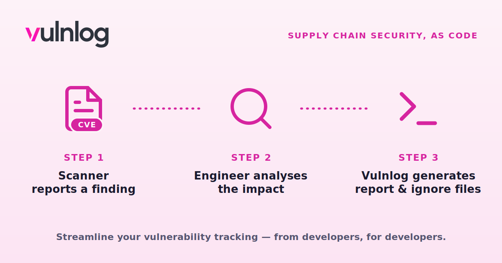

<picture>
  <source media="(prefers-color-scheme: dark)" srcset="website/img/vulnlog-overview-dark.svg">
  
</picture>

# Vulnlog

**Supply chain security, as code.**

[](https://github.com/vulnlog/vulnlog/releases)
[](https://github.com/vulnlog/vulnlog/actions/workflows/ci.yaml)
[](LICENSE)

Vulnlog is the single source of truth for vulnerability analysis: you record each finding's analysis and verdict once,
in a YAML file in your Git repository, and Vulnlog communicates that verdict to everyone who needs it -- your team, your
scanners, your customers, and your automation.

Vulnlog is a CLI application built around a YAML-based vulnerability definition file, designed to run in your CI
pipeline. It is open source and licensed under the Apache-2.0 license.

## One analysis, every audience

You analyse a finding once. Vulnlog communicates that verdict to everyone who needs it, in the form each one
understands:

- **Your team** the analysis, verdict, and justification live in the repository and are reviewed in pull requests, so
  decisions are durable and never re-litigated.
- **Your scanners** generate Trivy, Snyk, and generic suppression/ignore files (suppressions can be temporary and
  expire automatically; machine-readable VEX is planned) so CI stays green on triaged findings.
- **Your stakeholders and customers** a published HTML Vulnerability Report answers "are you affected by X?" without
  pulling engineers off their work.

And because every verdict is structured data with a recorded history and a CLI to read it, Vulnlog is the foundation for
what comes next: automated, AI-assisted vulnerability triage in your CI pipeline.

## Who is Vulnlog for?

| Audience                        | What Vulnlog gives them                                                                                                                 |
|---------------------------------|-----------------------------------------------------------------------------------------------------------------------------------------|
| **Software maintainers**        | Systematic, consistent triage of reported vulnerabilities, with the analysis and impact verdict recorded next to the code.              |
| **Product managers and owners** | The HTML Vulnerability Report with every finding and verdict in one place, to plan fix releases and track the product's security state. |
| **Customers and consumers**     | The published report, showing which vulnerabilities affect the software, their impact, and the version that fixes them.                 |
| **SCA scanners** (Snyk, Trivy)  | Up-to-date suppression/ignore files so CI scans stay green and known or irrelevant findings are not re-reported.                        |

## Why use Vulnlog?

Take **Log4Shell** ([CVE-2021-44228](https://en.wikipedia.org/wiki/Log4Shell)) as an example. Acme sells a JVM-based
Wiki product that depends on the Log4J library and runs two SCA scanners (Trivy and Snyk) nightly in CI. When
researchers disclose Log4Shell and Acme's next scan flags it as critical, Vulnlog turns the process into a workflow:

1. An engineer reviews the impact on the Wiki, records the analysis and verdict, and adds a temporary three-day
   suppression to the **Vulnlog YAML** file in the Git repository.
2. The next CI run invokes the **Vulnlog CLI**, regenerating the Trivy and Snyk **suppression/ignore files** and a fresh
   HTML **Vulnerability Report**.
3. The product manager reads the report and plans a release that contains the patched Log4J dependency.
4. Acme's customers raise a support ticket; the support team answers it straight from the published report, without
   pulling in the engineers.

## Quick Start

> [!NOTE]
> Vulnlog is in active development. The YAML format, CLI commands, and Gradle plugin may still change.
> Feedback and contributions are very welcome!

### Install the CLI

The install script detects your OS and architecture and installs a native binary:

```sh
curl -fsSL vulnlog.dev/install | sh
```

On macOS, install from the Homebrew tap:

```sh
brew install vulnlog/vulnlog/vulnlog
```

Or pull the Docker image:

```sh
docker pull ghcr.io/vulnlog/vulnlog:latest
```

To integrate Vulnlog into a Gradle build, add the plugin:

```kotlin
plugins {
    id("dev.vulnlog") version "<version>"
}
```

Native binaries and the JVM distribution are also published on the
[releases page](https://github.com/vulnlog/vulnlog/releases). See the
[installation docs](https://vulnlog.dev/docs/vulnlog/0.14.0/installation.html) for all
options, including build from source.

### Scaffold a new Vulnlog file

```sh
vulnlog init --organization "Acme Corp" --name "Acme Web App" --author "Security Team" -o vulnlog.yaml
```

This creates a minimal `vulnlog.yaml` you can start editing.

### Write your first entry

A Vulnlog file is plain YAML. Here is a minimal example:

```yaml
# $schema: https://vulnlog.dev/schema/vulnlog-v1.json
---
schemaVersion: "1"

project:
  organization: Acme Corp
  name: Acme Web App
  author: Security Team

releases:
  - id: 1.0.0
    published_at: 2026-01-15

vulnerabilities:

  - id: CVE-2026-1234
    description: Remote code execution in example-lib
    releases: [1.0.0]
    packages: ["pkg:npm/example-lib@2.3.0"]
    reports:
      - reporter: trivy
    analysis: >-
      The vulnerable code path is not reachable in our application because we only use
      the safe subset of the API.
    verdict: not affected
    justification: vulnerable code not in execute path
```

### Validate and generate suppression files and an HTML report

```sh
# Check the file for errors
vulnlog validate vulnlog.yaml

# Generate a Trivy suppression file for release 1.0.0
vulnlog suppress vulnlog.yaml --reporter trivy --release 1.0.0

# Generate an HTML report
vulnlog report vulnlog.yaml
```

## Documentation

- [Documentation](https://vulnlog.dev/docs/)
- [Project Website](https://vulnlog.dev/)
- [Changelog](CHANGELOG.md)
- [Get help](SUPPORT.md)

## Community

Have a question or an idea? Join the conversation in
[GitHub Discussions](https://github.com/vulnlog/vulnlog/discussions): ask in Q&A, propose features,
or share how you use Vulnlog.

[](https://bsky.app/profile/vulnlog.bsky.social)
[](https://infosec.exchange/@vulnlog)

## Contributing

Contributions are welcome! Whether it is a bug report, a docs fix, or a new feature -- check out
[CONTRIBUTING.md](CONTRIBUTING.md) to get started. If you are looking for something to pick up, look for issues
labelled **good first issue**.

⭐ If you find Vulnlog useful, giving it a star on GitHub helps others discover the project.

The Vulnlog contributors:

<a href="https://github.com/vulnlog/vulnlog/graphs/contributors">
  
</a>
