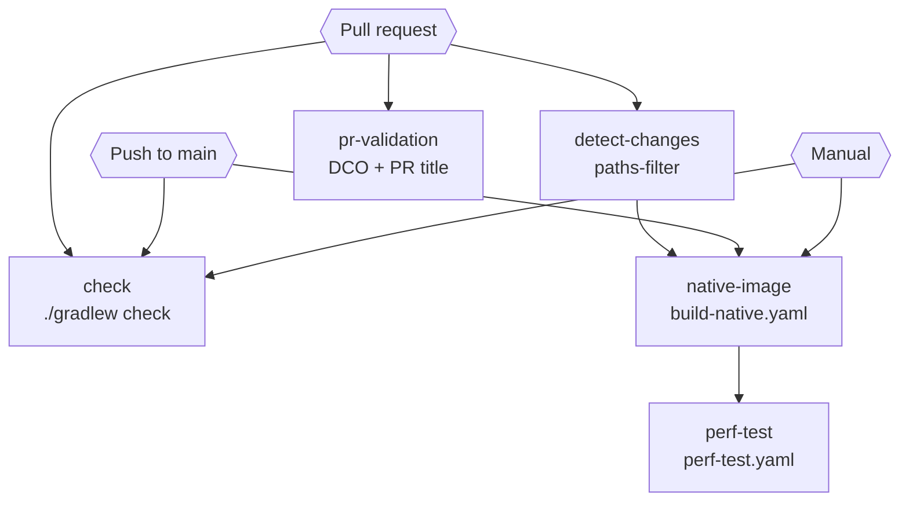
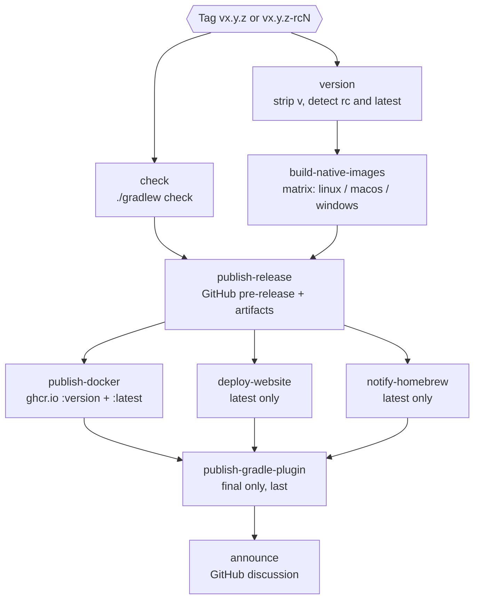
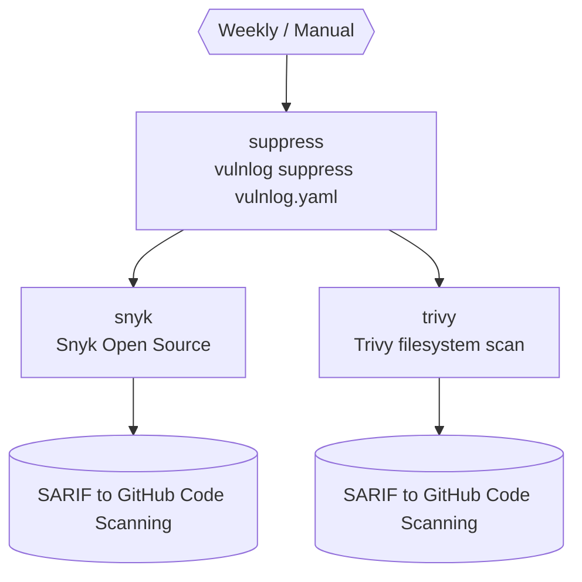

# GitHub Action Pipelines

Four pipelines drive the project:

| Pipeline          | File                                                            | Trigger                                                   |
|-------------------|-----------------------------------------------------------------|-----------------------------------------------------------|
| CI                | [`ci.yaml`](../.github/workflows/ci.yaml)                       | Pull requests, pushes to `main`, manual                   |
| Release           | [`release.yaml`](../.github/workflows/release.yaml)             | Tags matching `vx.y.z` or `vx.y.z-rcN`                    |
| Website deploy    | [`deploy-website.yml`](../.github/workflows/deploy-website.yml) | Called by Release, manual, weekly after Security Scanning |
| Security Scanning | [`security.yml`](../.github/workflows/security.yml)             | Weekly schedule, manual                                   |

## CI

Validates pull requests and main-branch pushes. CI never publishes anything; all publishing
happens in the Release pipeline.

The `native-image` job is conditional: it always runs on `main` pushes and `workflow_dispatch`,
but on pull requests only when the diff touches files relevant to the native build (detected
via `dorny/paths-filter`). `perf-test` depends on `native-image` and inherits this gate.

### Job details

- **pr-validation**: verifies every commit in the PR has a `Signed-off-by` trailer (DCO) and
  validates the PR title against the conventional-commits prefixes. Dependabot PRs are exempt
  from the DCO check because bot commits carry no sign-off.
- **detect-changes**: sets the `native_relevant` output if the PR touches any of:
  `modules/lib/src/main/resources/META-INF/native-image/**`,
  `modules/lib/src/main/kotlin/dev/vulnlog/lib/parse/**`, `modules/cli-app/**`,
  `modules/lib/build.gradle.kts`, `gradle/libs.versions.toml`, `buildSrc/**`.
- **check**: runs `./gradlew check` (compile, lint, unit tests, JVM integration tests) on
  Java 21 / Temurin via the [`setup-jvm`](../.github/actions/setup-jvm/action.yml) composite
  action.
- **native-image**: calls [`build-native.yaml`](../.github/workflows/build-native.yaml) with
  default inputs; uploads the Linux binary as artifact `vulnlog-linux-amd64`.
- **perf-test**: calls [`perf-test.yaml`](../.github/workflows/perf-test.yaml), which downloads
  `vulnlog-linux-amd64`, installs `hyperfine`, and runs
  [`perf/perf-test.sh`](../perf/perf-test.sh): 1 warmup plus 3 runs against `perf/perf.vl.yaml`
  for each of `validate`, `report`, `suppress`. Fails if any command's mean exceeds 1000 ms.
  Results uploaded as `perf-results` (30-day retention).

## Release

Triggered by version tags. The stages are ordered by reversibility: nothing is published
before the gate (check plus all native builds) passes, and the Gradle Plugin Portal
publication runs last because it cannot be retracted. Release candidate tags
(e.g. `v0.16.0-rc1`) run only the gate, the GitHub pre-release, and the versioned Docker
image. The `version` job also detects whether the pushed tag is the highest version overall;
a bug fix release for an older minor skips the website deploy, the Docker `:latest` tag, and
the Homebrew bump so none of them move backwards. The pipeline does not touch `CHANGELOG.md`
and does not render the GitHub-release body; both are prepared by the maintainer in a release
preparation PR before tagging (see [Releasing](Releasing.md)).

### Job details

- **version**: resolves the version (tag without the leading `v`), whether the tag is a final
  release (`final=true`) or a release candidate (`-rcN` suffix), and whether it is the highest
  version tag overall (`latest=true`). All other jobs consume these outputs, so the RC and
  latest logic lives in one place.
- **check**: same `./gradlew check` as in CI; part of the gate so a broken commit cannot be
  released even if it was tagged by mistake.
- **build-native-images**: matrix call of
  [`build-native.yaml`](../.github/workflows/build-native.yaml) for `ubuntu-latest`,
  `macos-latest`, and `windows-latest`.
- **publish-release**: builds the JVM distribution zip, downloads and re-zips the three native
  binaries, renders the install scripts, and creates a GitHub release marked
  `prerelease: true`. The body is GitHub's auto-generated "What's Changed"
  (`generate_release_notes: true`) plus a link to `CHANGELOG.md`; the maintainer refines it in
  the UI before un-flagging the pre-release.
- **publish-docker**: downloads the Linux native binary via the
  [`fetch-native-binary`](../.github/actions/fetch-native-binary/action.yml) composite action
  and pushes `ghcr.io/<repo>:<version>`; the floating `:latest` tag is added only when the
  tag is the latest version.
- **deploy-website**: calls [`deploy-website.yml`](../.github/workflows/deploy-website.yml)
  with the release version. Latest version only.
- **notify-homebrew**: calls `POST /repos/vulnlog/homebrew-vulnlog/dispatches` with
  `event_type=vulnlog-release` and `client_payload[version]=<version>` (authenticated via the
  `HOMEBREW_DISPATCH_TOKEN` secret). The tap's `bump-formula.yml` then recomputes the SHA256s,
  patches `vulnlog.rb`, and opens a bump PR. Depends on `publish-release` so the zip URLs are
  live before the tap fetches them. Latest version only.
- **publish-gradle-plugin**: runs `:gradle-plugin:publishPlugins`. Depends on all other
  publish jobs so the irreversible Portal publication happens only when everything else
  succeeded; it still runs when the latest-only jobs were skipped for a bug fix release of an
  older minor. The Gradle plugin's `:lib` dependency is shaded into the published jar (see
  [`modules/gradle-plugin/build.gradle.kts`](../modules/gradle-plugin/build.gradle.kts)) so no
  separate `:lib` artifact needs publishing. Final tags only.
- **announce**: opens an Announcement discussion via `abirismyname/create-discussion` (pinned
  by SHA). Runs last so the announcement never points at a half-published release.

## Website deploy

Single implementation of the GitHub Pages deploy. It builds the Antora docs, composes the
static site (website, docs, JSON schemas, install scripts, latest security report), and
deploys to `vulnlog.dev`.

Invoked three ways:

- **workflow_call** from the Release pipeline on final tags, with the release version as
  input.
- **workflow_dispatch** for manual deploys from `main` (e.g. quick doc fixes).
- **workflow_run** after a successful weekly Security Scanning run, so the bundled security
  report stays fresh.

When no version input is given, the version is read from `vulnlog-version` in
`docs/antora.yml`. The version is rendered into the install script and replaces the
`VULNLOG_VERSION` placeholder in `website/index.html`.

## Security

Weekly scan that mirrors the way downstream consumers would invoke Vulnlog: a `suppress` step
generates ignore files via the released Docker image, then Snyk and Trivy run in parallel
against the workspace using those files.

### Job details

- **suppress**: runs the released Vulnlog Docker image with
  `suppress vulnlog.yaml --output-dir /work` to produce `.snyk` and `.trivyignore.yaml`, then
  uploads them as the `suppressions` artifact. Also generates the HTML report that the website
  deploy bundles as `security-report.html`.
- **snyk**: runs the Snyk Gradle action with `--policy-path=.snyk --all-sub-projects`; uploads
  results as SARIF under category `snyk`. Requires the `SNYK_API_KEY` secret.
- **trivy**: runs the Trivy filesystem scan with `trivyignores: .trivyignore.yaml`; uploads
  results as SARIF under category `trivy`.

Both scanner jobs require `security-events: write` to upload SARIF.

## Shared building blocks

Common steps are factored out so each pipeline references them by name instead of inlining
their definitions.

| File                                                                       | Kind              | Purpose                                                                                                                                                                                                                                |
|----------------------------------------------------------------------------|-------------------|----------------------------------------------------------------------------------------------------------------------------------------------------------------------------------------------------------------------------------------|
| [`build-native.yaml`](../.github/workflows/build-native.yaml)              | Reusable workflow | GraalVM 25 setup and `:cli-app:nativeCompile` build. Inputs: `os`, `artifact-name`, `app-version` (leading `v` stripped), `retention-days`. Used by `ci.yaml`, `release.yaml`, and `perf-test.yaml` (standalone mode).                 |
| [`perf-test.yaml`](../.github/workflows/perf-test.yaml)                    | Reusable workflow | Runs `perf/perf-test.sh` (hyperfine) against the native binary. Inputs: `artifact-name`, `threshold-ms`. Also exposes `workflow_dispatch` for standalone runs, in which case it first calls `build-native.yaml` to produce the binary. |
| [`deploy-website.yml`](../.github/workflows/deploy-website.yml)            | Reusable workflow | GitHub Pages deploy of website and docs. Input: `version` (defaults to `vulnlog-version` from `docs/antora.yml`). Used by `release.yaml` and standalone via `workflow_dispatch` and `workflow_run`.                                    |
| [`setup-jvm`](../.github/actions/setup-jvm/action.yml)                     | Composite action  | Java 21 Temurin + Gradle setup. Used by the `check` jobs, `publish-release`, and `publish-gradle-plugin`.                                                                                                                              |
| [`fetch-native-binary`](../.github/actions/fetch-native-binary/action.yml) | Composite action  | Downloads the native-image artifact and marks it executable. Input: `artifact-name` (default `vulnlog-linux-amd64`). Used by `publish-docker` and `perf-test.yaml`.                                                                    |

### Running perf-test standalone

`perf-test.yaml` can be triggered manually from the Actions tab. The `build` job runs first
(calls `build-native.yaml`), then `perf` benchmarks the freshly built binary. When invoked
from `ci.yaml`, the `build` job is skipped and `perf` consumes the artifact uploaded by CI's
`native-image` job. The default threshold (1000 ms) is overridable per run.
