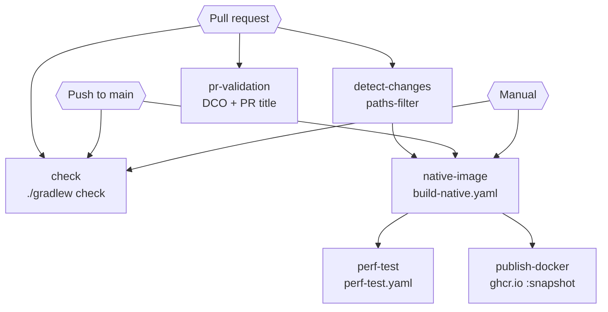
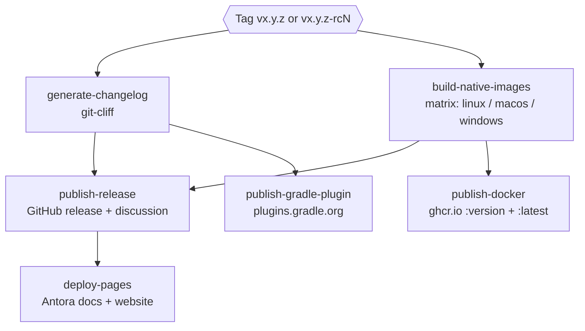
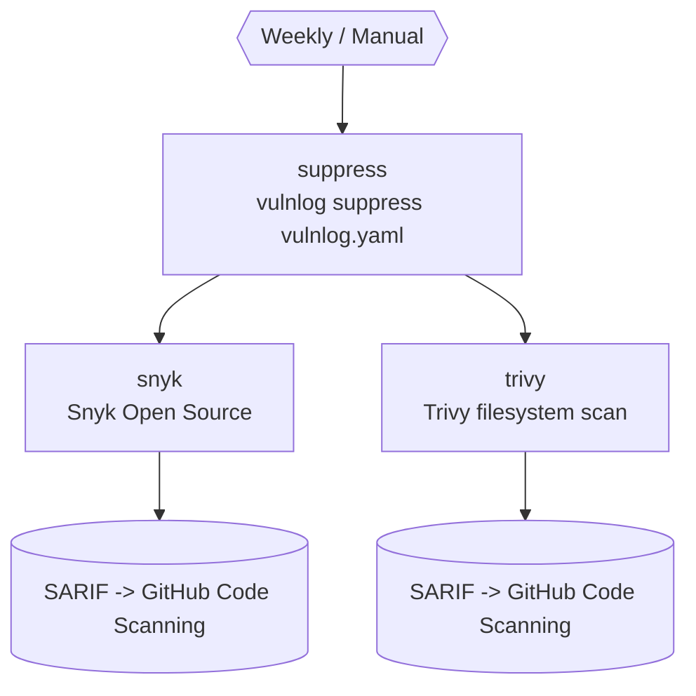

# GitHub Action Pipelines

Three pipelines drive the project:

| Pipeline               | File                                                | Trigger                                                               |
|------------------------|-----------------------------------------------------|-----------------------------------------------------------------------|
| Continuous Integration | [`ci.yaml`](../.github/workflows/ci.yaml)           | Pull requests, pushes to `main` and `vl-0.9`, weekly schedule, manual |
| Continuous Deployment  | [`cd.yaml`](../.github/workflows/cd.yaml)           | Tags matching `vx.y.z` or `vx.y.z-rcN`                                |
| Security Scanning      | [`security.yml`](../.github/workflows/security.yml) | Weekly schedule, manual                                               |

## CI

Validates pull requests and main-branch pushes.

The `native-image` job is conditional: it always runs on `main` pushes and `workflow_dispatch`, but on pull requests
only when the diff touches files relevant to the native build (detected via `dorny/paths-filter`). `perf-test` and
`publish-docker` both depend on `native-image` and so inherit this gate. `publish-docker` additionally only runs on
`main` pushes; `perf-test` runs whenever `native-image` did.

### Job details

- **pr-validation**: verifies every commit in the PR has a `Signed-off-by` trailer (DCO) and validates the PR title
  against the conventional-commits prefixes.
- **detect-changes**: sets the `native_relevant` output if the PR touches any of:
  `modules/lib/src/main/resources/META-INF/native-image/**`, `modules/lib/src/main/kotlin/dev/vulnlog/lib/parse/**`,
  `modules/cli-app/**`, `modules/lib/build.gradle.kts`, `gradle/libs.versions.toml`, `buildSrc/**`.
- **check**: runs `./gradlew check` (compile, lint, unit tests, JVM integration tests) on Java 21 / Temurin via the
  [`setup-jvm`](../.github/actions/setup-jvm/action.yml) composite action.
- **native-image**: calls [`build-native.yaml`](../.github/workflows/build-native.yaml) with default inputs; uploads the
  Linux binary as artifact `vulnlog-linux-amd64`.
- **perf-test**: calls [`perf-test.yaml`](../.github/workflows/perf-test.yaml), which downloads
  `vulnlog-linux-amd64`, installs `hyperfine`, and runs [`perf/perf-test.sh`](../perf/perf-test.sh) — 1 warmup +
  3 runs against `perf/perf.vl.yaml` for each of `validate`, `report`, `suppress`. Fails if any command's mean exceeds
  1000 ms. Results uploaded as `perf-results` (30-day retention).
- **publish-docker**: downloads the native binary via the
  [`fetch-native-binary`](../.github/actions/fetch-native-binary/action.yml) composite action and pushes
  `ghcr.io/<repo>:snapshot`. Only runs on `main` pushes.

## CD

Triggered by version tags. Release Candidate tags (e.g. `v0.12.0-rc1`) are detected via the `-` in the tag name; for
those, the changelog commit, GitHub discussion, the `:latest` Docker tag, and the docs/website deploy are skipped, while
native binaries, the (pre-)release, the versioned Docker tag, and the Gradle plugin publication still run.

Steps marked with dashed borders run only on final tags (no `-` in the tag name); other RC-aware gates apply at the step
level inside their jobs.

### Job details

- **generate-changelog**: runs `git-cliff` twice: once to update `CHANGELOG.md` (committed to `main` only on final tags)
  and once to produce the release-notes body for the GitHub release.
- **build-native-images**: matrix call of [`build-native.yaml`](../.github/workflows/build-native.yaml) for
  `ubuntu-latest`, `macos-latest`, and `windows-latest`. The tag (`github.ref_name`) is passed as `app-version`; the
  reusable workflow strips the leading `v` before invoking `-PappVersion=...`.
- **publish-release**: builds the JVM distribution zip, downloads and re-zips the three native binaries, and creates a
  GitHub release marked `prerelease: true`. On final tags also opens an Announcement discussion via
  `abirismyname/create-discussion` (pinned to v2.1.0 by SHA).
- **deploy-pages**: builds the Antora documentation, composes the static site, and deploys to GitHub Pages (
  `vulnlog.dev`). Skipped entirely on RC tags.
- **publish-docker**: downloads the Linux native binary via the
  [`fetch-native-binary`](../.github/actions/fetch-native-binary/action.yml) composite action and pushes
  `ghcr.io/<repo>:<tag>`; the floating `:latest` tag is added only on final releases.
- **publish-gradle-plugin**: runs `:gradle-plugin:publishPlugins`. Credentials are passed via
  `ORG_GRADLE_PROJECT_gradle.publish.key` / `...secret`. The Gradle plugin's `:lib` dependency is shaded into the
  published jar (see [`modules/gradle-plugin/build.gradle.kts`](../modules/gradle-plugin/build.gradle.kts)) so no
  separate `:lib` artifact needs publishing.

## Security

Weekly scan that mirrors the way downstream consumers would invoke Vulnlog: a `suppress` step generates ignore files via
the released Docker image, then Snyk and Trivy run in parallel against the workspace using those files.

### Job details

- **suppress**: runs `ghcr.io/<repo>:latest suppress vulnlog.yaml -o /work` to produce `.snyk` and `.trivyignore.yaml`,
  then uploads them as the `suppressions` artifact. `continue-on-error: true` so a missing image or empty Vulnlog config
  does not fail the whole run.
- **snyk**: runs `snyk/actions/gradle@master` with `--policy-path=.snyk --all-sub-projects`; uploads results as SARIF
  under category `snyk`. Requires `SNYK_API_KEY` secret.
- **trivy**: runs `aquasecurity/trivy-action@master` with `scan-type: fs` and `trivyignores: .trivyignore.yaml`; uploads
  results as SARIF under category `trivy`.

Both scanner jobs require `security-events: write` to upload SARIF.

## Shared building blocks

Common steps are factored out so each pipeline references them by name instead of inlining their definitions.

| File                                                                       | Kind              | Purpose                                                                                                                                                                                                                                |
|----------------------------------------------------------------------------|-------------------|----------------------------------------------------------------------------------------------------------------------------------------------------------------------------------------------------------------------------------------|
| [`build-native.yaml`](../.github/workflows/build-native.yaml)              | Reusable workflow | GraalVM 25 setup and `:cli-app:nativeCompile` build. Inputs: `os`, `artifact-name`, `app-version` (leading `v` stripped), `retention-days`. Used by `ci.yaml`, `cd.yaml`, and `perf-test.yaml` (standalone mode).                      |
| [`perf-test.yaml`](../.github/workflows/perf-test.yaml)                    | Reusable workflow | Runs `perf/perf-test.sh` (hyperfine) against the native binary. Inputs: `artifact-name`, `threshold-ms`. Also exposes `workflow_dispatch` for standalone runs, in which case it first calls `build-native.yaml` to produce the binary. |
| [`setup-jvm`](../.github/actions/setup-jvm/action.yml)                     | Composite action  | Java 21 Temurin + Gradle setup. Used by `check`, `publish-release`, `publish-gradle-plugin`.                                                                                                                                           |
| [`fetch-native-binary`](../.github/actions/fetch-native-binary/action.yml) | Composite action  | Downloads the native-image artifact and marks it executable. Input: `artifact-name` (default `vulnlog-linux-amd64`). Used by both `publish-docker` jobs and by `perf-test.yaml`.                                                       |

### Running perf-test standalone

`perf-test.yaml` can be triggered manually from the Actions tab. The `build` job runs first (calls `build-native.yaml`),
then `perf` benchmarks the freshly built binary. When invoked from `ci.yaml`, the `build` job is skipped and `perf`
consumes the artifact uploaded by ci's `native-image` job. The default threshold (`1000` ms) is overridable per run.
