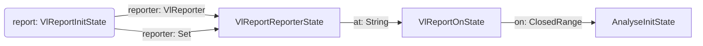
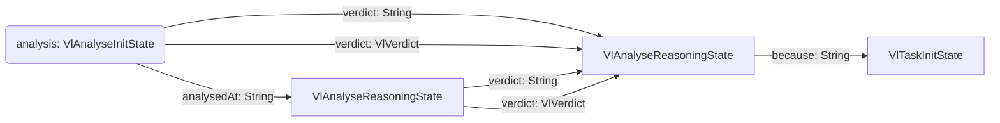
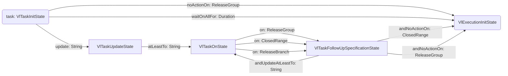
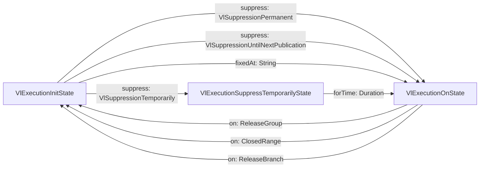

# {{ title }}

The `vuln` context describes the vulnerability in four fields: `report`, `analysis`, `task` and
`execution`.

| Field                                | Required | Description                                                                                                      |
|--------------------------------------|----------|------------------------------------------------------------------------------------------------------------------|
| [`report`](#report-init-state)       | yes      | Represents a vulnerability report in the vulnerability context. Every vulnerability context requires a `report`. |
| [`analysis`](#analyse-init-state)    | no       | Represents a vulnerability analysis in the vulnerability context. Requires `report` to be defined first.         |
| [`task`](#task-init-state)           | no       | Represents a vulnerability task in the vulnerability context. Requires `analysis` to be defined first.           |
| [`execution`](#execution-init-state) | no       | Represents a vulnerability execution in the vulnerability context. Requires `task` to be defined first.          |

Note: Each field has an abbreviated version consisting of the first letter to allow shorter
descriptions.

* `report` -> `r`
* `analysis` -> `a`
* `task` -> `t`
* `execution` -> `e`

## Report



Example:

```kotlin
report from dependencyScanner1 at "2025-01-08" on releaseBranch0..releaseBranch0
```

### Report Init State

Represents the initial state of a vulnerability report within the vulnerability reporting DSL.

| Function | Parameters                                    | Return                                          |
|----------|-----------------------------------------------|-------------------------------------------------|
| `from`   | The `reporter` that found the vulnerability.  | [Report Reporter State](#report-reporter-state) |
| `from`   | The `reporters` that found the vulnerability. | [Report Reporter State](#report-reporter-state) |

### Report Reporter State

Defines the date since when the software security engineering team is aware of this vulnerability.

| Function | Parameters                                                | Return                              |
|----------|-----------------------------------------------------------|-------------------------------------|
| `at`     | A date string in the format YYYY-MM-dd, e.g. `2025-03-07` | [Report On State](#report-on-state) |

### Report On State

Define on what release branches the reported vulnerability was found.

| Function | Parameters                                | Return                                    |
|----------|-------------------------------------------|-------------------------------------------|
| `on`     | A range of release branches e.g. `v1..v2` | [Analyse Init State](#analyse-init-state) |

## Analysis



Example:

```kotlin
analysis analysedAt "2025-01-12" verdict notAffected because "The vulnerable method `foo()` is not used."
```

### Analyse Init State

Represents the initial analysis state of the vulnerability analysis process within the DSL. Extends
the Verdict interface. Allows specifying the date of the analysis.

| Function     | Parameters                                                                                                  | Return                                              |
|--------------|-------------------------------------------------------------------------------------------------------------|-----------------------------------------------------|
| `analysedAt` | A date string in the format YYYY-MM-dd, e.g. `2025-03-07`. If not specified the date of the report is used. | [Analyse Verdict State](#analyse-verdict-state)     |
| `verdict`    | A verdict based on the analysis of the report on the software project.                                      | [Analyse Reasoning State](#analyse-reasoning-state) |

### Analyse Verdict State

This interface represents a specific state within the vulnerability analysis DSL. It extends the
base `verdict` behavior and provides a focus on analysis-related verdicts for software project
reports.

It serves as a part of the fluent interface design to chain analysis verdict actions within the
vulnerability reporting and task management DSL.

| Function  | Parameters                                                             | Return                                              |
|-----------|------------------------------------------------------------------------|-----------------------------------------------------|
| `verdict` | A verdict based on the analysis of the report on the software project. | [Analyse Reasoning State](#analyse-reasoning-state) |

### Analyse Reasoning State

Represents the reasoning state within the analysis DSL. This is used to specify the rationale behind
a verdict choice during the analysis process.

| Function  | Parameters                                | Return                              |
|-----------|-------------------------------------------|-------------------------------------|
| `because` | The reasoning why the verdict was chosen. | [Task Init State](#task-init-state) |

## Task



Example:

```kotlin
task update "vulnerable.dependency" atLeastTo "1.2.3" on releaseBranch0
```

### Task Init State

Represents the initial state of a task in the vulnerability task management DSL. It serves as the
starting point for defining task initialization actions within the DSL.

| Function       | Parameters                                                  | Return                                        |
|----------------|-------------------------------------------------------------|-----------------------------------------------|
| `update`       | The dependency to update as string.                         | [Task Update State](#task-update-state)       | 
| `noActionOn`   | No actions required on `releaseGroup`.                      | [Execution Init State](#execution-init-state) | 
| `waitOnAllFor` | Wait on all release branches for `duration`, e.g., 14.days. | [Execution Init State](#execution-init-state) | 

### Task Update State

Represents an interface for updating the state of a vulnerability task to a specific version. This
interface is utilized within the vulnerability reporting DSL to define and manage version updates
for tasks in a fluent and declarative manner.

| Function    | Parameters                                  | Return                          |
|-------------|---------------------------------------------|---------------------------------|
| `atLeastTo` | Update at least to the specified `version`. | [Task On State](#task-on-state) | 

### Task On State

Represents the task-on-state within the vulnerability lifecycle management DSL, allowing the
specification of actions and follow-up state on certain release branches or groups.

| Function | Parameters                                         | Return                                        | 
|----------|----------------------------------------------------|-----------------------------------------------|
| `on`     | Describe on what `releaseGroup` this task applies. | [Task Follow Up State](#task-follow-up-state) | 
| `on`     | Describe on what `releases` this task applies.     | [Task Follow Up State](#task-follow-up-state) | 
| `on`     | Describe on what `release` this task applies.      | [Task Follow Up State](#task-follow-up-state) | 

### Task Follow Up State

Represents the follow-up state of a task in the vulnerability lifecycle management DSL, allowing
further actions to be defined on specific release branches or release groups.

| Function             | Parameters                                    | Return                                        |
|----------------------|-----------------------------------------------|-----------------------------------------------|
| `andNoActionOn`      | No further action required on `releases`.     | [Execution Init State](#execution-init-state) |
| `andNoActionOn`      | No further action required on `releaseGroup`. | [Execution Init State](#execution-init-state) |
| `andUpdateAtLeastTo` | Update at least to the specified `version`.   | [Task On State](#task-on-state)               |

## Execution



Example:

```kotlin
execution suppress untilNextPublication on releaseBranch0
```

### Execution Init State

Represents the initial state of an execution in the vulnerability lifecycle management DSL. This
interface provides methods to suppress or resolve vulnerabilities during the DSL workflow.

| Function   | Parameters                                                                           | Return                                                                        |
|------------|--------------------------------------------------------------------------------------|-------------------------------------------------------------------------------|
| `fixedAt`  | Mark a vulnerability as fixed at `date` e.g. `2025-03-07`.                           | [Execution on State](#execution-on-state)                                     |
| `suppress` | Suppress a vulnerability permanently: `permanent`                                    | [Execution On State](#execution-on-state)                                     |
| `suppress` | Suppress a vulnerability for a certain amount of time:`temporarily`                  | [Execution Suppress Temporarily State](#execution-suppress-temporarily-state) |
| `suppress` | Suppress a vulnerability until the next release is published: `untilNextPublication` | [Execution On State](#execution-on-state)                                     |

### Execution Suppress Temporarily State

Represents a state in the vulnerability lifecycle management DSL where execution is temporarily
suppressed. This interface allows specifying a waiting duration before transitioning to the next
state.

| Function  | Parameters                            | Return                                    | 
|-----------|---------------------------------------|-------------------------------------------|
| `forTime` | Duration to wait fore, e.g. `14.days` | [Execution On State](#execution-on-state) | 

### Execution On State

Represents the transition state for executing actions on specific releases or release groups within
the vulnerability lifecycle management DSL.

This interface provides methods to specify the target releases or release groups where the defined
actions will be applied.

| Function | Parameters                                              | Return                              | 
|----------|---------------------------------------------------------|-------------------------------------|
| `on`     | Describe on what `releaseGroup` this execution applies. | A complete [Execution](#Execution)  | 
| `on`     | Describe on what `releases` this execution applies.     | A complete [Execution](#Execution)  | 
| `on`     | Describe on what `release` this execution applies.      | A complete  [Execution](#Execution) | 


