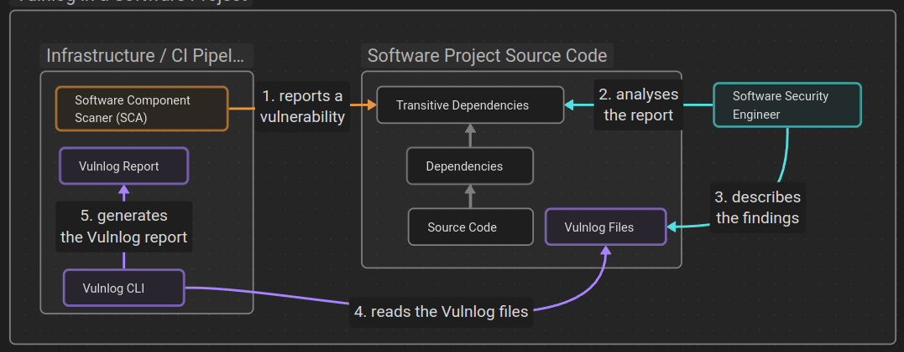

## What is Vulnlog?

Vulnlog is a developer-oriented tool for tracking and documenting software vulnerabilities. It enables engineering teams to maintain a single source of truth for vulnerability management using a custom domain-specific language (DSL) that integrates seamlessly with your codebase.

At its core, Vulnlog utilises a Git-versioned log file and a command-line interface. This setup allows teams to query, filter, and generate reports based on specific product versions. The tool's design philosophy emphasises transparency and repeatability, making it straightforward to incorporate vulnerability tracking into existing development and security workflows.

## Why did we create Vulnlog?

Vulnerabilities are often identified by different scanners across various software versions. While the analysis of these findings is typically carried out with care, the results are rarely documented in a consistent or structured way. In many cases, information ends up scattered in suppression files, wiki pages, or ticketing systems — leading to several issues:

* Media break: Analysis happens in the IDE or code, while documentation lives in Confluence or other browser-based tools. 
* Missing history: Confluence has limited searchability, and Git history is only helpful if commit messages are well-maintained. 
* Lack of transparency: People outside the immediate development team often have no insight into which vulnerabilities are known or under review.

Vulnlog addresses this by introducing a unified format and workflow for vulnerability tracking. With everything in a versioned log file, developers and security engineers can work closer to their tools, maintain a searchable history, and generate useful outputs such as reports or suppression files — all from the same source of truth.

## How it works

Vulnlog is part of your software project.

Here is an example Vulnlog entry describing the reported vulnerability CVE-2025-001.

```kotlin
vuln("CVE-2025-001") {
    report from dependencyScanner1 at "2025-01-08" on releaseBranch0..releaseBranch0
    analysis analysedAt "2025-01-12" verdict notAffected because "The vulnerable method `foo()` is not used."
    task update "vulnerable.dependency" atLeastTo "1.2.3" on releaseBranch0
    execution suppress untilNextPublication on releaseBranch0
}
```

Overview of the Vulnlog workflow within a software project.



1. A security scanner regularly scans the project source code base in CI pipelines. Once a potential vulnerability is found, it notifies the software security team. 
2. A software security engineer analyses the report and its potential impact on the software project. 
3. They note the verdict, a conclusion as well as further actions in the Vulnlog file as a new entry. 
4. The Vulnlog CLI parses the Vulnlog files and 
5. generates Vulnlog reports for the team.

## Key features

* Track vulnerabilities in your software in one single place, your repository. 
* Generate reports for you, your peers, product managers, or support team. 
* Manage multiple release branches and generate separate reports per release branch.
